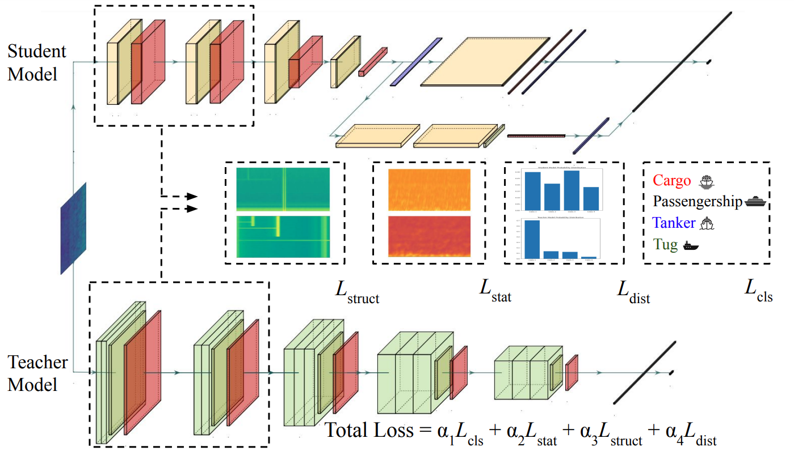

# Structural and Statistical Audio Texture Knowledge Distillation (SSATKD) for Passive Sonar Classification
<p align="center">
  
</p>


**Structural and Statistical Audio Texture Knowledge Distillation (SSATKD) for Passive Sonar Classification**

Jarin Ritu, Amirmohammad Mohammadi, Davelle Carreiro, Alexandra Van Dine, Joshua Peeples

Note: If this code is used, cite it:  TBD (Authors). (202X, Month Day). TBD: Initial Release (Version v1.0).
Zendo. https://doi.org/10.5281/zenodo.14593898.
[](https://doi.org/10.5281/zenodo.14593898)

[`arXiv`](https://arxiv.org/abs/2307.13788)

[`BibTeX`](#CitingHist)


In this repository, we provide the paper and code for " Structural and Statistical Audio Texture Knowledge Distillation (SSATKD) for Passive Sonar Classification."

## Installation Prerequisites


The [`requirements.txt`](requirements.txt) file includes all the necessary packages, and the packages will be installed using:

   ```pip install -r requirements.txt```

Or, a pre-configured environment file, light.yml, is available in the project directory. Follow these steps to set it up:

Open a terminal and navigate to the project directory.
Create the Conda environment

  ```conda env create -f light.yml```
  
Activate the environment:
  
  ```conda activate <environment_name>```
  
Run SSATKD!

## Demo

To get started, please follow the instructions in the [Datasets](Datasets) folder to download the dataset.
Next, run [`demo.py`](demo.py) in Python IDE (e.g., Spyder) or command line to train, validate, and test models. 
To evaluate performance,
run [`View_Results.py`](View_Results.py) (if results are saved out).


## Main Functions

The target classification code uses the following functions. 

1. Intialize model  

   ```model = intialize_model(**Parameters)```

2. Prepare dataset(s) for model
   
   ```data_module = DeepShipDataModule(**Parameters)```

3. Train model 

   ```trainer.fit(**Parameters)```

4. Test model

   ```trainer.test(**Parameters)```


## Parameters

The parameters can be set in the following script:
   
[`Demo_Parameters.py`](Demo_Parameters.py)

## Inventory

```
https://github.com/Peeples-Lab/HLTDNN 

└── root directory
    ├── demo.py                           // Run this. Main demo file.
    ├── Demo_Parameters.py                // Parameter file for the demo.
    ├── View_Results.py                   // Run this after the demo to view saved results. 
    └── Datasets                
        ├── Get_Preprocessed_Data.py      // Resample the audio data and generate segments for the dataset.
        └── DeepShipDataModules.py.py     // Create a custom dataset for DeepShip.
    └── Utils                     
        ├── Class_information.py          // Class names for dataset for the results script.
        ├── Compute_FDR.py                // Compute Fisher’s discriminant ratio.
        ├── Compute_EHD.py                // Compute edge responses. 
        ├── Confusion_mats.py             // Create and plot confusion matrix.
        ├── Generate_Learning_Curves.py   // Generate learning curves for training and validation.
        ├── Generate_TSNE_visual.py       // Generate TSNE visuals.
        ├── Generate_Spatial_Dims.py      // Compute spatial dimensions for histogram layer models.
        ├── Get_Optimizer.py              // Define a set of optimizers to choose from.
        ├── Histogram_Model.py            // Load histogram model with TDNN (or any backbone network).
        ├── Network_functions.py          // Contains functions to initialize, train, and test the model.
        ├── RBFHistogramPooling.py        // Create histogram layer.
        ├── Save_Results.py               // Save results from the demo script.
        ├── pytorchtools.py               // Implement early stopping to terminate training based on validation metrics.
        └── Feature_Extraction_Layer.py   // Extract and transform different features from the audio files.
        └── TDNN.py                       // Baseline TDNN model.
        └── DTIEM_Model_RBF.py            // Statistical module.
        └── EDM.py                        // Structural module.
        └── EMD_loss.py                   // Compute Earth Mover Distance loss.
        └── Lightning_Wrapper.py          // simplifies training by organizing code and automating tasks like logging and checkpoints
        └── Loss_function.py              // Define all the loss functions.
        └── PANN_models.py                // Define pretrained audio neural networks.
        └── SSTKAD_v2.py                  // Define SSATKD model.


```

## License

This source code is licensed under the license found in the [`LICENSE`](LICENSE) file in the root directory of this source tree.

This product is Copyright (c) 202X TBD. All rights reserved.

## <a name="CitingHist"></a>Citing SSATKD

If you use the SSATKD code, please cite the following reference using the following entry.

**Plain Text:**

TBD

**BibTex:**

```
TBD
```
